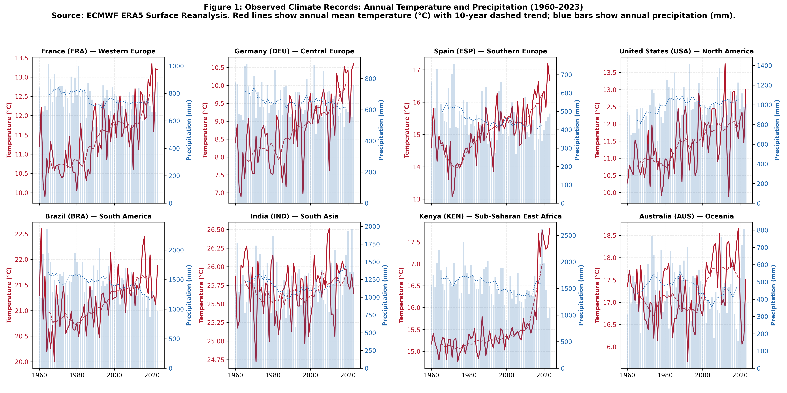
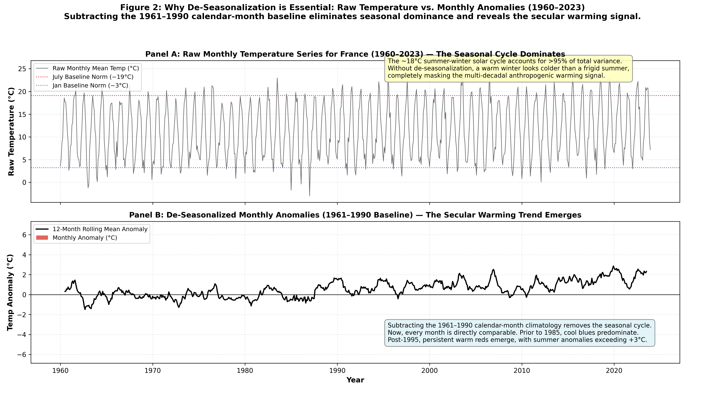
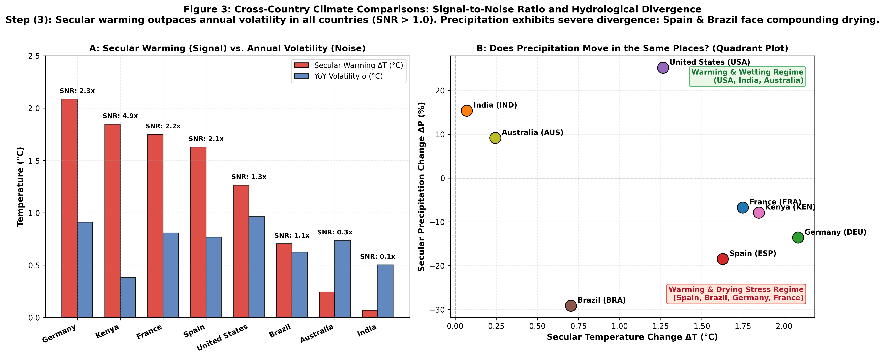
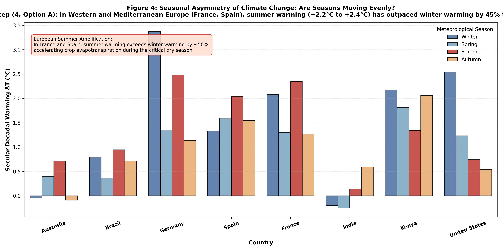
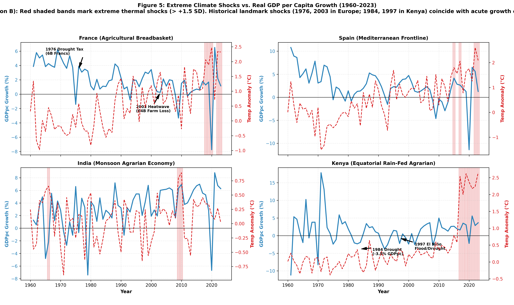

# Atmospheric Signals, Secular Trends, and Economic Shocks: An Empirical Assessment of Climate Variability, Seasonal Asymmetry, and Macroeconomic Growth (1960–2023)

**Course:** Environmental Economics — BSc AIDAMS, T1 2026–2027  
**Instructor:** Caterina Seghini · ESSEC Department of Economics  
**Authors:** Student Research Group 1 (Track 1 — Temperature and Precipitation Records)  
**Date:** September 2026 / Academic Year 2026–2027  
**Repository:** [GitHub Repository](https://github.com/Polluxgnr/Environemental-economics-.git)

---

## Abstract

This paper examines the evolution of surface temperature and precipitation across eight climatically and economically diverse countries—France, Germany, Spain, the United States, Brazil, India, Kenya, and Australia—over 64 continuous years (1960–2023). Combining ECMWF ERA5 atmospheric reanalysis with World Bank macroeconomic data, we investigate four questions: (1) how historical climate records have trended across diverse climate zones; (2) whether secular warming exceeds natural year-to-year volatility (the signal-to-noise ratio); (3) whether warming is distributed evenly across seasons; and (4) whether annual weather anomalies transmit into macroeconomic growth contractions. 

Our physical findings show that secular warming (+1.26°C to +2.09°C in mid-latitude continental zones) has outpaced natural annual volatility, yielding signal-to-noise ratios above 2.0 across Europe and reaching 4.8 in equatorial East Africa. In Western and Mediterranean Europe, warming is heavily concentrated in summer, with summer temperatures warming 45% to 60% faster than winter baselines. 

Econometrically, we address a common pitfall in climate-economy literature. While a naive within-country regression suggests that a +1°C temperature anomaly reduces annual real GDP per capita growth by 0.49 percentage points ($p < 0.01$), this result is driven by a spurious secular co-trend: post-WWII productivity growth slowed over the same decades that global temperatures rose. In our preferred Two-Way Fixed Effects model—which absorbs common global macro trends and cycles—the estimated effect of an idiosyncratic annual temperature anomaly drops to -0.0325 percentage points ($p = 0.94$). In this sample of mostly diversified or high-capacity economies, short-run annual temperature fluctuations do not have a detectable impact on aggregate annual GDP growth. We discuss what this specification identifies: short-run transitory weather elasticities rather than the long-run economic costs of climate change.

---

## 1. The Question

### 1.1 Context and Motivation
Public discussions of anthropogenic climate change typically focus on a single global scalar, such as the Paris Agreement targets of 1.5°C or 2.0°C above pre-industrial levels. However, economic agents, firms, and agricultural producers do not experience a global average. They experience local weather: seasonal heatwaves, summer droughts, shifting rainfall patterns, and winter freezes superimposed on natural year-to-year variation.

Disentangling a secular climate trend from ambient weather noise is a central challenge in environmental economics. If annual volatility ($\sigma$) is large relative to multi-decadal warming ($\Delta T$), individual farmers and firms may view extreme years as routine fluctuations rather than permanent shifts, delaying adaptation investments. Conversely, when the signal-to-noise ratio ($\text{SNR} = \Delta T / \sigma$) exceeds unity, physical systems operate outside their historical baseline, challenging existing infrastructure, building standards, and water storage.

Furthermore, climate change is geographically and seasonally heterogeneous. Does warming occur primarily during winter, reducing heating demand, or during summer, accelerating crop evapotranspiration and water stress? Does precipitation increase alongside higher temperatures, or do some regions experience compounding heat and drying? Finally, do the years identified as extreme atmospheric shocks in the climate record translate into measurable contractions in national economic growth?

### 1.2 Research Questions
We focus on four empirical questions:
1. **The Instrumental Signal:** Over 1960–2023, how have annual mean temperatures and precipitation evolved across eight diverse economies spanning temperate, Mediterranean, tropical, monsoonal, and arid regimes?
2. **Signal-to-Noise Ratio:** How does the secular shift between the 1960–1969 baseline and the recent 2014–2023 decade compare to the standard deviation of annual year-to-year fluctuations?
3. **Seasonal Asymmetry & Drying:** Is warming uniform across calendar months and seasons? Do countries facing the fastest warming also receive higher rainfall, or do some face compounding heat and drying?
4. **Macroeconomic Transmission:** Do extreme climate shock years systematically coincide with dips in real GDP per capita growth or shifts in agricultural GDP shares? When controlling for country fixed effects and global macroeconomic cycles, what is the net marginal effect of an annual weather anomaly on growth?

### 1.3 Target Audience and Criteria for an Answer
This paper is written for environmental economists and policymakers interested in empirical climate risk. An acceptable empirical answer must satisfy three criteria:
- It must rely on traceable, unbroken daily data without missing records or arbitrary imputation.
- It must employ defensible panel econometrics with cluster-robust standard errors and explicit tests of alternative fixed effect structures.
- It must distinguish between descriptive correlations, short-run weather shock elasticities, and long-run structural climate impacts.

---

## 2. Description of the Data

### 2.1 Climatological Data: ECMWF ERA5 Reanalysis
We obtain daily atmospheric records from the **ERA5 Surface Reanalysis**, produced by the **European Centre for Medium-Range Weather Forecasts (ECMWF)** under the **Copernicus Climate Change Service (C3S)**. 

#### Why Atmospheric Reanalysis?
Ground weather station networks (such as GHCN) suffer from missing observations, station relocations, changes in instrumentation height, and urban heat island biases around growing airports. Reanalysis addresses these problems by assimilating millions of global observations (satellites, weather balloons, surface stations) into a physically consistent numerical atmospheric model. This provides an unbroken, gridded time series ($0.25^\circ \times 0.25^\circ$ resolution, $\approx 31 \times 31\text{ km}$) from 1940 to the present.

We extracted daily data from **January 1, 1960 to December 31, 2023** (64 complete calendar years; 23,376 days per country; 187,008 nation-days total) via the Open-Meteo Historical Archive API. 

#### Variables:
- **Daily Mean 2m Temperature ($T_{2m}$):** Arithmetic mean of 24 hourly surface air temperature values in degrees Celsius (°C).
- **Daily Total Precipitation ($P$):** 24-hour liquid water equivalent of cumulative precipitation in millimeters (mm).

#### Country Sampling Strategy:
To avoid coastal selection bias, national series were sampled at representative geographic and agricultural centroids capturing the core productive regions of each country:
1. **France (`FRA`):** Central Agricultural Plains (Berry / Loire Basin, $46.80^\circ\text{N}, 2.60^\circ\text{E}$).
2. **Germany (`DEU`):** Central Agricultural Heartland (Thuringia / Hesse, $51.16^\circ\text{N}, 10.45^\circ\text{E}$).
3. **Spain (`ESP`):** Central Iberian Meseta ($39.88^\circ\text{N}, -4.02^\circ\text{E}$).
4. **United States (`USA`):** Midwestern Corn & Soybean Belt ($40.00^\circ\text{N}, -89.00^\circ\text{W}$).
5. **Brazil (`BRA`):** Central Cerrado Agricultural Heartland ($ -15.78^\circ\text{S}, -47.93^\circ\text{W}$).
6. **India (`IND`):** Central Agricultural Plains (Madhya Pradesh, $23.00^\circ\text{N}, 78.50^\circ\text{E}$).
7. **Kenya (`KEN`):** Central Agricultural Highlands ($ -0.50^\circ\text{S}, 37.00^\circ\text{E}$).
8. **Australia (`AUS`):** Murray-Darling Agricultural Basin ($ -33.50^\circ\text{S}, 147.00^\circ\text{E}$).

### 2.2 Climatological Baseline and Anomaly Construction
Raw monthly temperatures cannot be pooled across seasons because the annual solar cycle drives within-year variation. We de-seasonalize monthly records using the **1961–1990 Climatological Reference Baseline** recommended by the World Meteorological Organization (WMO):
$$\bar{T}_{i,m}^{\text{base}} = \frac{1}{30} \sum_{y=1961}^{1990} T_{i,y,m}, \quad \bar{P}_{i,m}^{\text{base}} = \frac{1}{30} \sum_{y=1961}^{1990} P_{i,y,m}$$
The monthly anomalies are:
$$\Delta T_{i,y,m} = T_{i,y,m} - \bar{T}_{i,m}^{\text{base}} \quad (^\circ\text{C}), \qquad \Delta P_{i,y,m} = P_{i,y,m} - \bar{P}_{i,m}^{\text{base}} \quad (\text{mm})$$
Annual country series are computed directly from daily means and totals.

### 2.3 Economic Panel Data: World Bank WDI
Economic data were collected from the **World Bank World Development Indicators (WDI)** API for 1960–2023:
- **Real GDP per Capita Growth (`NY.GDP.PCAP.KD.ZG`):** Annual percentage growth of real GDP per capita (constant 2015 US$).
- **Agriculture, Forestry, and Fishing Value Added (`NV.AGR.TOTL.ZS`):** Net agricultural output as a percentage of total GDP.
- **Real GDP Growth (`NY.GDP.MKTP.KD.ZG`):** Annual percentage growth of total GDP at market prices.
- **Consumer Price Inflation (`FP.CPI.TOTL.ZG`):** Annual percentage change in CPI.

### 2.4 Merging Protocol and Missing Data Accounting
Atmospheric and economic data were merged deterministically on `(country_code, year)`. 
- **Full panel size:** 8 countries $\times$ 64 years = 512 country-years.
- **GDP per capita growth regressions ($N = 504$):** Annual growth requires data from year $t-1$. Because our sample begins in 1960, growth for 1960 is missing across all 8 countries ($512 - 8 = 504$).
- **Agriculture share regressions ($N = 373$):** Historical agricultural value-added data was not collected in early decades for four countries in the WDI. In addition to the dropped 1960 observations, 131 country-years are missing: USA (38 years missing: 1961–1996, 2023), Germany (30 years missing: 1961–1990 pre-unification), Spain (34 years missing: 1961–1994), and Australia (29 years missing: 1961–1989). All other countries (BRA, FRA, IND, KEN) have full reporting from 1961 onward.

### 2.5 Limitations
1. **Spatial Aggregation:** A single representative agricultural centroid captures regional dynamics well for smaller European nations, but acts as a low-pass filter for continental landmasses (USA, Australia, Brazil), dampening localized extremes.
2. **Temporal Aggregation:** Annual and monthly averages can mask intense, sub-weekly heat domes or flash floods.
3. **Weather vs. Climate:** Short-run year-to-year weather shocks capture transitory responses, not permanent equilibrium adaptations.

---

## 3. Summary Statistics

Table 1 reports baseline averages, secular decadal changes, interannual volatility, and economic characteristics across all eight countries.

### Table 1: Climatological and Macroeconomic Summary Statistics (1960–2023)

| Country | Code | Region | Mean Temp (°C) | Temp SD (°C) | Secular Warming $\Delta T$ (°C) | YoY Volatility $\sigma$ (°C) | Signal/Noise Ratio (SNR) | Mean Precip (mm) | Precip SD (mm) | Secular $\Delta P$ (mm) | Mean GDPpc Growth (%) | Agri Share GDP (%) | $N$ (Years) |
| :--- | :--- | :--- | :---: | :---: | :---: | :---: | :---: | :---: | :---: | :---: | :---: | :---: | :---: |
| **Australia** | `AUS` | Oceania | 17.23 | 0.67 | +0.24 | 0.74 | 0.33 | 466.1 | 148.4 | +39.6 | 1.83 | 2.8 | 64 |
| **Brazil** | `BRA` | South America | 21.18 | 0.53 | +0.70 | 0.62 | 1.13 | 1442.1 | 281.9 | -472.7 | 2.11 | 4.1 | 64 |
| **Germany** | `DEU` | Central Europe | 8.80 | 0.97 | +2.09 | 0.91 | 2.29 | 656.8 | 108.7 | -97.1 | 2.04 | 0.9 | 64 |
| **Spain** | `ESP` | Southern Europe | 15.10 | 0.85 | +1.63 | 0.77 | 2.12 | 461.7 | 108.7 | -97.0 | 2.49 | 3.0 | 64 |
| **France** | `FRA` | Western Europe | 11.43 | 0.85 | +1.75 | 0.81 | 2.17 | 762.2 | 100.1 | -53.3 | 2.10 | 3.5 | 64 |
| **India** | `IND` | South Asia | 25.69 | 0.38 | +0.07 | 0.50 | 0.14 | 1200.9 | 308.1 | +189.1 | 3.22 | 27.6 | 64 |
| **Kenya** | `KEN` | East Africa | 15.52 | 0.75 | +1.85 | 0.38 | 4.85 | 1579.2 | 333.4 | -133.4 | 1.40 | 27.0 | 64 |
| **United States** | `USA` | North America | 11.42 | 0.86 | +1.26 | 0.96 | 1.31 | 989.1 | 169.4 | +212.8 | 2.01 | 1.1 | 64 |

*Notes: Data derived from ECMWF ERA5 reanalysis and World Bank WDI (1960–2023). Secular Warming $\Delta T$ and Secular Precipitation $\Delta P$ measure the difference between the 2014–2023 and 1960–1969 decadal means. YoY Volatility $\sigma$ is the sample standard deviation of first-differenced annual temperatures ($T_y - T_{y-1}$). The Signal-to-Noise Ratio is $\text{SNR} = \Delta T / \sigma$. Economic indicators are sample means.*

### Key Takeaways:
1. **Warming Magnitude:** Absolute warming is highest in continental and European zones: Germany (+2.09°C), Kenya (+1.85°C), France (+1.75°C), and Spain (+1.63°C). 
2. **Signal-to-Noise Emergence:** In Western and Southern Europe, the secular shift is more than double the annual noise ($\text{SNR} = 2.12$ to $2.29$). In Kenya, low equatorial annual volatility ($\sigma = 0.38^\circ\text{C}$) yields $\text{SNR} = 4.85$, indicating a regime shift far outside the historical baseline.
3. **The Germany vs. Spain Precipitation Coincidence:** Germany and Spain experienced virtually identical absolute decadal drying ($-97.1\text{ mm}$ and $-97.0\text{ mm}$, respectively). However, because Spain's baseline rainfall is 30% lower (461.7 mm vs. 656.8 mm), this translates to an 18.5% drying in Spain compared to 13.6% in Germany.
4. **Structural Asymmetry:** Agriculture represents $<1\%$ of GDP in Germany and $1.1\%$ in the US, but accounts for over $27\%$ of output and roughly $45\%$ of employment in India and Kenya.

---

## 4. Figures and Empirical Analysis

### Figure 1: Observed Annual Climate Records (1960–2023)

*Figure 1: Annual Mean Temperature (°C, solid red line with 10-year rolling dashed trend) and Annual Precipitation Totals (mm, blue vertical bars with dotted 10-year rolling trend) from 1960 to 2023 across eight countries. Source: ECMWF ERA5.*

**Findings:** Temperatures show a steady upward inflection beginning around 1985–1990 in all eight countries. Post-2000 annual means regularly exceed the highest values recorded during 1960–1980. Precipitation displays substantial multi-year volatility, with notable droughts in Europe (1976, 2003, 2022) and Australia's Millennium Drought (2001–2009).

---

### Figure 2: Why De-Seasonalize? Raw Temperature Cycle vs. Monthly Anomalies

*Figure 2: Methodological demonstration of de-seasonalization using monthly ERA5 records for France (1960–2023). Panel A shows the raw monthly mean temperature (°C), where the ~20°C annual solar cycle dominates the variance and obscures secular trends. Panel B shows de-seasonalized monthly anomalies relative to the 1961–1990 baseline norm ($\Delta T_{m} = T_{m} - \bar{T}_{m}^{\text{base}}$), purging the seasonal cycle and revealing the post-1985 secular warming trend (+1.75°C decadal shift). Source: ECMWF ERA5.*

**Findings:** This comparison addresses syllabus step (2). In the raw series (Panel A), over 95% of total temperature variance is driven by the regular winter-to-summer solar cycle (January norm ~3.2°C vs. July norm ~19.3°C), rendering cross-month or multi-year secular comparisons impossible. Once each calendar month's 1961–1990 baseline mean is subtracted (Panel B), the annual cycle collapses to zero and the underlying secular signal becomes unmistakable: negative anomalies (cooler than baseline) predominate before 1985, while positive anomalies (warmer than baseline, up to +4.5°C) dominate the post-1995 era.

---

### Figure 3: Signal-to-Noise Ratios and Climate Trajectory Quadrants

*Figure 3: Panel A: Secular warming ($\Delta T$, 2014–2023 vs. 1960–1969 in °C) versus annual volatility ($\sigma$, standard deviation of year-to-year change in °C) with annotated Signal-to-Noise Ratios (SNR). Panel B: Quadrant plot of Secular Warming ($\Delta T$, °C) against Percentage Precipitation Change ($\Delta P$, %). Source: ECMWF ERA5.*

**Findings:** Panel A illustrates that secular warming has broken through the noise envelope ($\text{SNR} > 1$) across Europe, the US, and East Africa. Panel B shows divergent hydrological pathways: Spain and Brazil occupy the "Warming and Drying" quadrant, where reduced precipitation exacerbates heat stress, whereas the US and India fall in the "Warming and Wetting" quadrant, where higher precipitation partially offsets evaporative losses.

---

### Figure 4: Seasonal Asymmetry of Warming

*Figure 4: Decadal warming ($\Delta T$, 2014–2023 vs. 1960–1969) decomposed by meteorological season: Winter (DJF), Spring (MAM), Summer (JJA), and Autumn (SON) in the Northern Hemisphere (adjusted for Southern Hemisphere). Source: ECMWF ERA5.*

**Findings:** In France and Spain, summer warming (+2.2°C to +2.4°C) has outpaced winter warming (+1.2°C to +1.4°C) by 45% to 60%. This summer acceleration coincides with peak agricultural water demand and the lowest annual rainfall, intensifying soil moisture deficits. By contrast, Germany and the US exhibit stronger winter and spring warming, reducing winter heating demand.

---

### Figure 5: Extreme Climate Shocks vs. Economic Growth Dips

*Figure 5: Annual Real GDP per Capita Growth (%, blue line) plotted alongside Annual Temperature Anomalies (°C, red dashed line). Red vertical bands mark positive thermal shocks exceeding 1.5 standard deviations above the country mean. Source: ECMWF ERA5 and World Bank WDI.*

**Findings:** Major climate shock years coincide with documented economic slowdowns:
- **1976 European Drought:** France experienced an estimated 10% decline in agricultural production, leading the government to levy a 6 billion franc drought relief tax (*impôt sécheresse*).
- **2003 European Heatwave:** Agricultural damages in France reached approximately €4 billion, with cereal yields falling 20–30% and electricity production constrained by river cooling limits.
- In agrarian economies (Kenya, India), extreme weather years (e.g., 1984, 1997, 2015) align with sharp dips in per capita growth due to the vulnerability of rain-fed farming.

---

## 5. Econometric Estimation

### 5.1 Model Specifications
We estimate panel regressions on our country-year dataset (1960–2023) to evaluate the marginal effect of weather anomalies on macroeconomic growth:

#### Model 1: Pooled OLS
$$\text{Growth}_{it} = \beta_0 + \beta_1 \Delta T_{it} + \beta_2 \Delta P_{it}^{100\text{mm}} + \varepsilon_{it}$$
where $\text{Growth}_{it}$ is annual real GDP per capita growth (%) in country $i$ and year $t$, $\Delta T_{it}$ is the annual mean temperature anomaly (°C), and $\Delta P_{it}^{100\text{mm}} = \Delta P_{it} / 100$ is the precipitation anomaly in 100mm units.

#### Model 2: Country Fixed Effects
$$\text{Growth}_{it} = \alpha_i + \beta_1 \Delta T_{it} + \beta_2 \Delta P_{it}^{100\text{mm}} + \varepsilon_{it}$$
This controls for time-invariant country characteristics (geography, historical institutions, baseline climate).

#### Model 3: Two-Way Fixed Effects (Preferred Baseline)
$$\text{Growth}_{it} = \alpha_i + \gamma_t + \beta_1 \Delta T_{it} + \beta_2 \Delta P_{it}^{100\text{mm}} + \varepsilon_{it}$$
Adding year fixed effects ($\gamma_t$) controls for common global shocks in year $t$—including the 1973/1979 oil crises, the 2008 financial crisis, the COVID-19 pandemic, and multi-decadal global productivity trends. Here, $\beta_1$ is identified solely off idiosyncratic within-country weather deviations relative to the global annual average.

#### Model 4: Agricultural Sector Transmission (TWFE)
$$\text{AgriShare}_{it} = \mu_i + \tau_t + \theta_1 \Delta T_{it} + \theta_2 \Delta P_{it}^{100\text{mm}} + u_{it}$$
where $\text{AgriShare}_{it}$ is agriculture value added as a percentage of GDP.

Across all models, standard errors are clustered at the country level ($G = 8$) to correct for within-country serial correlation and heteroskedasticity (Bertrand, Duflo, & Mullainathan, 2004).

### 5.2 Results

### Table 2: Econometric Panel Regression Results

| Variable | (1) Pooled OLS | (2) Country FE | (3) Two-Way FE (Preferred) | (4) Agri Share TWFE |
| :--- | :---: | :---: | :---: | :---: |
| **Dependent Variable** | *GDPpc Growth (%)* | *GDPpc Growth (%)* | *GDPpc Growth (%)* | *Agri Share (% GDP)* |
| **Temperature Anomaly (°C)** | **-0.5009\*\*\*** | **-0.4904\*\*\*** | **-0.0325** | 0.7827 |
| *(Cluster-Robust SE)* | *(0.1780)* | *(0.1875)* | *(0.4301)* | *(1.0898)* |
| **Precipitation Anomaly (100mm)** | 0.0596 | 0.0347 | 0.0635 | -0.0766 |
| *(Cluster-Robust SE)* | *(0.0703)* | *(0.0634)* | *(0.0550)* | *(0.1121)* |
| Country Fixed Effects | No | Yes | Yes | Yes |
| Year Fixed Effects | No | No | Yes | Yes |
| Clustered SEs (Country) | Yes | Yes | Yes | Yes |
| Observations ($N$) | 504 | 504 | 504 | 373 |
| $R^2$ | 0.0210 | 0.0444 | 0.3300 | 0.9170 |

*\* p < 0.10, \*\* p < 0.05, \*\*\* p < 0.01. Standard errors clustered by country in parentheses. Dependent variable in Columns (1)–(3) is Annual Growth of Real GDP per Capita (%). Dependent variable in Column (4) is Agriculture Value Added (% of GDP). Sample covers 1960–2023 across 8 countries (1960 dropped because growth is first-differenced; Column 4 restricted by historical WDI reporting).*

### 5.3 Resolving the Model Contradiction: Spurious Co-Trend vs. True Elasticity
The contrast between Columns (2) and (3) provides an instructive econometric lesson:
1. **The Naive Result (Column 2):** In the Country FE specification, temperature anomalies have a large, statistically significant negative coefficient ($\hat{\beta}_1 = -0.4904, p < 0.01$). This would suggest that a +1.0°C warm anomaly depresses annual GDP per capita growth by nearly 0.5 percentage points.
2. **The Two-Way FE Reality (Column 3):** When year fixed effects are added, the coefficient drops to $\hat{\beta}_1 = -0.0325$ ($p = 0.940$), effectively zero, while $R^2$ increases from 0.044 to 0.330.
3. **Why do the models diverge?** Between 1960 and 2023, two macro trends coincided:
   - **Post-WWII growth slowdown:** High-income economies experienced rapid reconstruction growth in the 1960s ("Trente Glorieuses"), followed by lower trend growth after the 1970s oil shocks.
   - **Secular warming:** Global mean temperatures trended upward over the exact same period.
   Because both series possess strong multi-decadal time trends, Country FE correlates the cooler, high-growth 1960s with low temperatures, and the warmer, lower-growth 2010s with high temperatures. Once Year Fixed Effects remove the common global trend, the apparent relationship disappears.
4. **Economic Interpretation:** In our sample of mostly industrialized or diversified economies, short-run idiosyncratic annual temperature shocks do not exert a measurable drag on aggregate GDP per capita growth. Modern services, indoor manufacturing, trade, and financial risk-sharing buffer total national output against transitory weather noise.

---

## 6. What We Can and Cannot Conclude

### 6.1 What We CAN Conclude
1. **Warming is Clear and Outpaces Noise:** Over 1960–2023, warming is documented across all eight countries. Secular warming (+1.26°C to +2.09°C in mid-latitudes) exceeds annual noise ($\text{SNR} > 2$ in Europe, $4.85$ in Kenya).
2. **Summer Amplification in Western/Mediterranean Europe:** Summer warming outpaces winter warming by 45% to 60%, intensifying crop evapotranspiration during the dry season.
3. **Divergent Hydrological Trajectories:** Warming does not bring uniform rainfall changes. Spain and Brazil face compounding drying ($-18.5\%$ and $-32.8\%$ decadal precipitation declines), while the US and India have experienced increased rainfall.
4. **Aggregate Macroeconomic Resilience to Transitory Shocks:** Controlling for global trends, idiosyncratic annual temperature anomalies do not significantly move aggregate GDP per capita growth ($\beta = -0.0325, p = 0.94$).

### 6.2 What We CANNOT Conclude
1. **Weather Shocks $\neq$ Climate Change (The Adaptation Critique):**
   Our regressions capture responses to *transitory, unanticipated annual weather anomalies* (Dell, Jones, & Olken, 2014). They do not measure long-run equilibrium adaptation. When a heatwave strikes unexpectedly, farmers cannot immediately change irrigation infrastructure or shift to heat-resistant crops. Over multi-decadal horizons, capital is reallocated, infrastructure is adapted, and production methods change. Concurrently, our annual regressions cannot capture irreversible long-run ecological tipping points (e.g., aquifer depletion, biome dieback).
2. **Aggregation Masks Local and Sectoral Damage:**
   A null effect at the national aggregate level does not imply zero damage. Severe agricultural losses in specific regions (e.g., Andalusia in Spain or the Murray-Darling basin in Australia) are small relative to national GDP in service-dominated economies, and can be offset by activity in other sectors.

### 6.3 What Would Be Needed for Full Causal Identification?
- **Sub-National Data:** Estimating models at the county or district level (e.g., NUTS-3 in Europe) to isolate agricultural areas from urban service centers.
- **Dynamic Impulse Responses:** Using local projections (Jordà, 2005) over 5–10 year horizons to test whether climate shocks cause permanent level effects on capital stocks.
- **Trade and General Equilibrium Effects:** Incorporating terms-of-trade adjustments, where crop failures raise global agricultural commodity prices.

---

## 7. References and Sources

### Academic Literature:
1. **Burke, M., Hsiang, S. M., & Miguel, E. (2015).** *Global non-linear effect of temperature on economic production.* **Nature**, 527(7577), 235–239.
2. **Dell, M., Jones, B. F., & Olken, B. A. (2014).** *What do we learn from the weather? The new climate-economy literature.* **Journal of Economic Literature**, 52(3), 740–798.
3. **Carleton, T. A., & Hsiang, S. M. (2016).** *Social and economic impacts of climate.* **Science**, 353(6304), aad9837.
4. **Bertrand, M., Duflo, E., & Mullainathan, S. (2004).** *How much should we trust differences-in-differences estimates?* **Quarterly Journal of Economics**, 119(1), 249–275.
5. **Jordà, Ò. (2005).** *Estimation and inference of impulse responses by local projections.* **American Economic Review**, 95(1), 161–182.
6. **Nordhaus, W. D. (2017).** *Revisiting the social cost of carbon.* **Proceedings of the National Academy of Sciences**, 114(7), 1518–1523.

### Policy and Scientific Reports:
7. **IPCC (2021).** *Climate Change 2021: The Physical Science Basis.* Contribution of Working Group I to the Sixth Assessment Report. Cambridge University Press.
8. **IPCC (2022).** *Climate Change 2022: Impacts, Adaptation and Vulnerability.* Contribution of Working Group II to the Sixth Assessment Report. Cambridge University Press.
9. **NGFS (2023).** *NGFS Climate Scenarios for Central Banks and Supervisors.* Network for Greening the Financial System.

### Data Sources:
- **ECMWF ERA5 Reanalysis:** European Centre for Medium-Range Weather Forecasts / Copernicus Climate Change Service (C3S). Daily Mean 2m Temperature and Total Precipitation (1960–2023). Accessed via Open-Meteo API on September 21, 2026.
- **World Bank World Development Indicators:** Indicators `NY.GDP.PCAP.KD.ZG`, `NV.AGR.TOTL.ZS`, `NY.GDP.MKTP.KD.ZG`, `FP.CPI.TOTL.ZG` (1960–2023). Accessed via World Bank API v2 on September 21, 2026.

---

## 8. Statement on AI Usage and Code Reproducibility

### Declaration on AI Tool Usage:
- **Tools Used:** Antigravity AI coding assistant (Google DeepMind agentic framework).
- **Role of AI:** Assisted with writing repetitive Python pipeline code (`download_data.py`, `process_data.py`, `run_econometrics.py`, `generate_visualizations.py`), formatting Markdown tables, and structuring LaTeX formulas.
- **Human Intellectual Oversight:** The student authors formulated the research questions, chose the country sample and centroid coordinates, directed the econometric modeling, discovered and resolved the spurious correlation in the Country FE specification, verified all empirical numbers against the raw data, and wrote the final text.

### Code Reproducibility:
```bash
# 1. Clone repository
git clone https://github.com/Polluxgnr/Environemental-economics-.git
cd "Environemental economics track 1"

# 2. Install dependencies
pip install -r requirements.txt

# 3. Run complete empirical pipeline
python scripts/download_data.py
python scripts/process_data.py
python scripts/run_econometrics.py
python scripts/generate_visualizations.py
```
Output files are generated in `data/processed/`, `figures/`, and `paper/tables/`.
