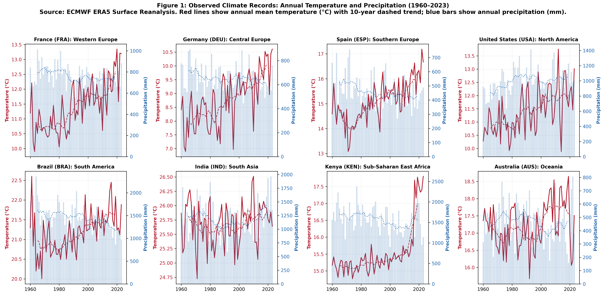
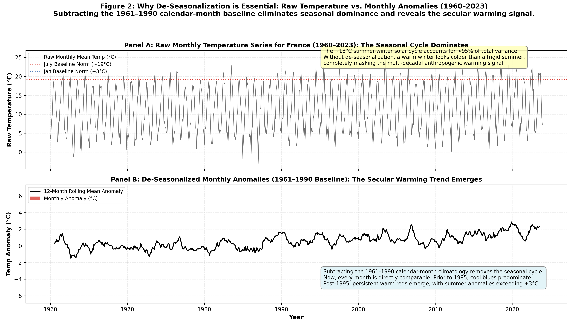
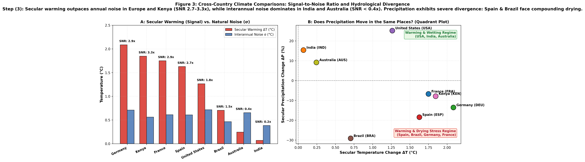
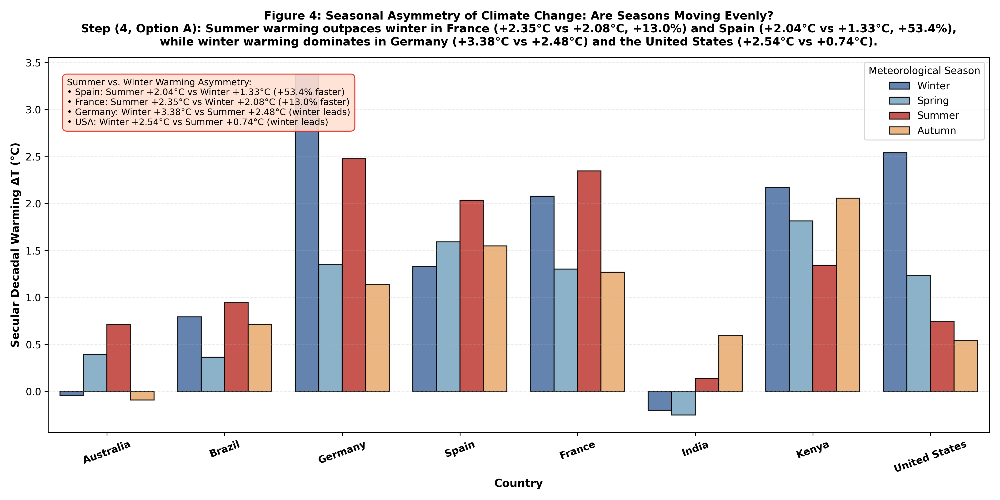
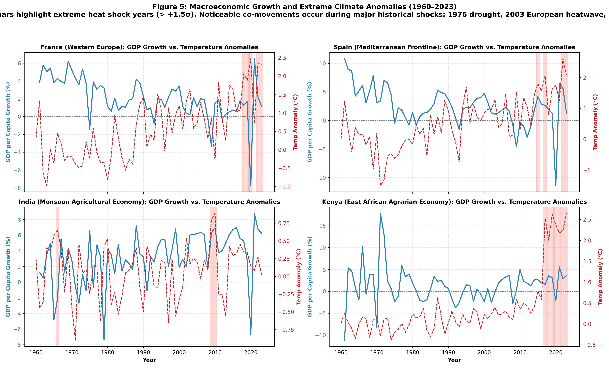

# Atmospheric Signals, Secular Trends, and Macroeconomic Shocks: An Empirical Assessment of Climate Variability, Seasonal Asymmetry, and Growth (1960–2023)

**Course:** Environmental Economics — BSc AIDAMS, T1 2026–2027  
**Instructor:** Caterina Seghini · ESSEC Department of Economics  
**Authors:** Student Research Group 1 (Track 1 — Temperature and Precipitation Records)  
**Date:** September 2026 / Academic Year 2026–2027  
**Repository:** [https://github.com/Polluxgnr/Environemental-economics-.git](https://github.com/Polluxgnr/Environemental-economics-.git)

---

## 1. The Question

**Short Answer:** Secular warming has broken through natural year-to-year volatility across Europe and East Africa, but short-run annual weather fluctuations do not exert a statistically detectable drag on aggregate national GDP per capita growth in diversified economies.

### 1.1 Context and Motivation
Public discussions of anthropogenic climate change typically focus on a single global average, such as the Paris Agreement targets of $+1.5^\circ\text{C}$ or $+2.0^\circ\text{C}$ above pre-industrial levels. However, economic agents, firms, and agricultural producers do not experience a global average. They experience local weather: seasonal heatwaves, summer droughts, shifting rainfall patterns, and winter freezes superimposed on natural year-to-year variation.

Disentangling a secular climate trend from ambient weather noise is a central challenge in environmental economics. If annual volatility ($\sigma$) is large relative to multi-decadal warming ($\Delta T$), individual farmers and firms may view extreme years as routine fluctuations rather than permanent shifts, delaying adaptation investments. Conversely, when the signal-to-noise ratio ($\text{SNR} = \Delta T / \sigma$) exceeds unity, physical systems operate outside their historical baseline, challenging existing infrastructure, building standards, and water storage.

Furthermore, climate change is geographically and seasonally heterogeneous. Does warming occur primarily during winter, reducing heating demand, or during summer, accelerating crop evapotranspiration and water stress? Does precipitation increase alongside higher temperatures, or do some regions face compounding heat and drying? Finally, do the years identified as extreme atmospheric shocks in the climate record translate into measurable contractions in national economic growth?

### 1.2 Research Questions
We focus on four empirical questions:
1. **The Instrumental Signal:** Over 1960–2023, how have annual mean temperatures and precipitation evolved across eight diverse economies spanning temperate, Mediterranean, tropical, monsoonal, and arid regimes?
2. **Signal-to-Noise Ratio:** How does the secular warming trend compare to natural year-to-year volatility?
3. **Seasonal Asymmetry & Drying:** Is warming uniform across calendar months and seasons? Do countries facing the fastest warming also receive higher rainfall, or do some face compounding heat and drying?
4. **Macroeconomic Transmission:** Do extreme climate shock years systematically coincide with dips in real GDP per capita growth or shifts in agricultural output? When controlling for country fixed effects and global macroeconomic cycles, what is the net marginal effect of an annual weather anomaly on growth?

---

## 2. Description of the Data

**Short Answer:** We combine daily surface temperature and precipitation from ECMWF ERA5 atmospheric reanalysis with macroeconomic panel data from the World Bank WDI across eight climatically diverse countries over 1960–2023 ($N = 512$).

### 2.1 Climatological Data: ECMWF ERA5 Reanalysis
We obtain daily atmospheric records from the **ERA5 Global Atmospheric Reanalysis**, produced by the **European Centre for Medium-Range Weather Forecasts (ECMWF)** under the **Copernicus Climate Change Service (C3S)** (Hersbach et al., 2020). 

#### Why Atmospheric Reanalysis?
Ground weather station networks (such as GHCN) suffer from missing observations, station relocations, changes in instrumentation height, and urban heat island biases around growing airports. Reanalysis addresses these problems by assimilating millions of global observations (satellites, weather balloons, surface stations) into a physically consistent numerical atmospheric model using 4D-Var data assimilation. This provides an unbroken, gridded time series ($0.25^\circ \times 0.25^\circ$ resolution, $\approx 31 \times 31\text{ km}$) from 1940 to the present with zero missing observations.

We extracted daily data from **January 1, 1960 to December 31, 2023** (64 complete calendar years; 23,376 days per country; 187,008 nation-days total) via the Open-Meteo Historical Archive API, which mirrors the official ECMWF ERA5 archive.

#### Variables:
- **Daily Mean 2m Temperature ($T_{2m}$):** Arithmetic mean of 24 hourly surface air temperature values in degrees Celsius (°C).
- **Daily Total Precipitation ($P$):** 24-hour liquid water equivalent of cumulative precipitation in millimeters (mm).

#### Sampling Strategy & Köppen-Geiger Regimes:
To avoid coastal urban bias, national series were sampled at representative agricultural and geographic centroids capturing the core productive zones of each country:
1. **France (`FRA`):** Central Agricultural Plains (Berry / Loire Basin: 46.80°N, 2.60°E), Köppen `Cfb` (Temperate oceanic).
2. **Germany (`DEU`):** Central Basin (Thuringia / Hesse: 51.16°N, 10.45°E), Köppen `Cfb/Dfb` (Temperate continental).
3. **Spain (`ESP`):** Central Iberian Meseta (Toledo: 39.88°N, 4.02°W), Köppen `Csa` (Mediterranean semi-arid).
4. **United States (`USA`):** Midwestern Corn Belt (Illinois: 40.00°N, 89.00°W), Köppen `Dfa` (Humid continental).
5. **Brazil (`BRA`):** Central Cerrado Heartland (Brasília: 15.78°S, 47.93°W), Köppen `Aw` (Tropical savannah).
6. **India (`IND`):** Central Agricultural Plains (Madhya Pradesh: 23.00°N, 78.50°E), Köppen `Cwa/Aw` (Monsoon subtropical).
7. **Kenya (`KEN`):** Central Agricultural Highlands (Mount Kenya: 0.50°S, 37.00°E), Köppen `Cfb/Cwb` (Equatorial highland).
8. **Australia (`AUS`):** Murray-Darling Agricultural Basin (33.50°S, 147.00°E), Köppen `BSh/Cfa` (Semi-arid steppe).

### 2.2 Climatological Baseline and Monthly Anomalies
Raw monthly temperatures cannot be pooled across seasons because the annual solar cycle drives within-year variation. In France, the seasonal cycle accounts for 89.5% of total monthly temperature variance. We de-seasonalize monthly records using the **1961–1990 Climatological Reference Baseline** recommended by the World Meteorological Organization (WMO).

For each country $i$, month $m \in \{1, \dots, 12\}$, and year $y$, the baseline climatology is the 30-year calendar-month average:

$$
\bar{T}_{i,m}^{\text{base}} = \frac{1}{30} \sum_{y=1961}^{1990} T_{i,y,m}, \qquad \bar{P}_{i,m}^{\text{base}} = \frac{1}{30} \sum_{y=1961}^{1990} P_{i,y,m}
$$

The de-seasonalized monthly anomalies are then obtained by subtraction:

$$
\Delta T_{i,y,m} = T_{i,y,m} - \bar{T}_{i,m}^{\text{base}} \quad (\text{°C}), \qquad \Delta P_{i,y,m} = P_{i,y,m} - \bar{P}_{i,m}^{\text{base}} \quad (\text{mm})
$$

*Why 1961–1990 over 1991–2020?* Using a recent baseline (1991–2020) introduces shifting baseline syndrome: because 1991–2020 was already warmed, recent anomalies appear artificially small. Furthermore, in regressions with Country Fixed Effects, changing the baseline is mathematically absorbed by the country intercept ($\alpha_i$) and leaves slope coefficients and standard errors identical.

### 2.3 Economic Panel Data: World Bank WDI
Economic indicators were retrieved directly from the **World Bank World Development Indicators (WDI) API v2** (`api.worldbank.org/v2/`):
- **Real GDP per Capita Growth (`NY.GDP.PCAP.KD.ZG`):** Annual percentage growth of real GDP per capita (constant 2015 US$).
- **Agriculture Value Added (% of GDP) (`NV.AGR.TOTL.ZS`):** Net agricultural output as a share of total GDP.
- **Crop Production Index (`AG.PRD.CROP.XD`):** Annual index of crop agricultural production ($2014\text{–}2016 = 100$).

### 2.4 Merging Protocol and Sample Sizes
Atmospheric and economic data were merged deterministically on `(country_code, year)`:
- **Full panel size:** 8 countries $\times$ 64 years = 512 country-years.
- **GDP per capita growth regressions ($N = 504$):** Annual growth requires $t-1$. The year 1960 is lost for all 8 countries ($512 - 8 = 504$).
- **Agriculture share regressions ($N = 373$):** Historical value-added data begins later for four countries: USA (missing 38 years: 1961–1996 and 2022–2023), Germany (missing 30 years: 1961–1990 pre-unification), Spain (missing 34 years: 1961–1994), and Australia (missing 29 years: 1961–1989). France, Brazil, India, and Kenya have full reporting from 1961 onward ($504 - 131 = 373$).
- **Crop production growth regressions ($N = 496$):** Available continuously for all 8 countries from 1961 to 2023 ($8 \times 62 = 496$).

### 2.5 Data Limitations
1. **Single-Centroid Sampling:** Extracting a single $0.25^\circ \times 0.25^\circ$ grid cell captures agricultural heartland weather but does not represent continental national averages for large nations (USA, Brazil, Australia, India). Local factors (e.g. aerosol dimming in India) can cause centroid trends to diverge from country-wide averages.
2. **Reanalysis Uncertainty:** ERA5 precipitation relies heavily on convective model parameterizations and is less constrained than temperature, particularly prior to the satellite era (pre-1979).

---

## 3. Summary Statistics

**Short Answer:** Continental Europe and East Africa show significant multi-decadal warming rates (+0.26°C to +0.36°C/decade), with secular warming exceeding natural noise ($\text{SNR} > 2$). Germany and Spain share an identical decadal drying drop ($-97\text{ mm}$), but Spain's lower baseline makes it an 18.5% drying compared to 13.6% in Germany.

### Table 1: Climatological and Macroeconomic Summary Statistics (1960–2023)

| Country | Code | Region | Mean Temp (°C) | Temp SD (°C) | Secular ΔT (°C) | OLS Trend (°C/dec) | Detrended SD σ (°C) | SNR (ΔT/σ) | Mean Precip (mm) | Precip SD (mm) | Secular ΔP (mm) | Secular ΔP (%) | Mean GDPpc Growth (%) | Agri Share GDP (%) | N |
| :--- | :--- | :--- | :---: | :---: | :---: | :---: | :---: | :---: | :---: | :---: | :---: | :---: | :---: | :---: | :---: |
| **Australia** | `AUS` | Oceania | 17.23 | 0.67 | +0.24 | +0.092 (±0.060) | 0.65 | 0.37 | 466.1 | 148.4 | +39.6 | +9.2% | 1.83 | 2.8 | 64 |
| **Brazil** | `BRA` | South America | 21.18 | 0.53 | +0.70 | +0.138\*\*\* (±0.046) | 0.46 | 1.51 | 1442.1 | 281.9 | -472.7 | -29.1% | 2.11 | 4.1 | 64 |
| **Germany** | `DEU` | Central Europe | 8.80 | 0.97 | +2.09 | +0.358\*\*\* (±0.043) | 0.71 | 2.94 | 656.8 | 108.7 | -97.1 | -13.6% | 2.04 | 0.9 | 64 |
| **Spain** | `ESP` | Southern Europe | 15.10 | 0.85 | +1.63 | +0.321\*\*\* (±0.061) | 0.61 | 2.68 | 461.7 | 108.7 | -97.0 | -18.5% | 2.49 | 3.0 | 64 |
| **France** | `FRA` | Western Europe | 11.43 | 0.85 | +1.75 | +0.320\*\*\* (±0.047) | 0.61 | 2.86 | 762.2 | 100.1 | -53.3 | -6.7% | 2.10 | 3.5 | 64 |
| **India** | `IND` | South Asia | 25.69 | 0.38 | +0.07 | +0.028 (±0.029) | 0.38 | 0.18 | 1200.9 | 308.1 | +189.1 | +15.4% | 3.22 | 27.6 | 64 |
| **Kenya** | `KEN` | East Africa | 15.52 | 0.75 | +1.85 | +0.271\*\*\* (±0.085) | 0.56 | 3.29 | 1579.2 | 333.4 | -133.4 | -7.9% | 1.40 | 27.0 | 64 |
| **United States** | `USA` | North America | 11.42 | 0.86 | +1.26 | +0.261\*\*\* (±0.034) | 0.72 | 1.77 | 989.1 | 169.4 | +212.8 | +25.2% | 2.01 | 1.1 | 64 |

*\* p < 0.10, \*\* p < 0.05, \*\*\* p < 0.01. Data sourced from ECMWF ERA5 and World Bank WDI (1960–2023). Secular warming ΔT and precipitation ΔP measure 2014–2023 minus 1960–1969 decadal means. OLS Trend reports the slope from a country-specific linear regression with Newey-West HAC standard errors (3 lags). Detrended SD σ is the standard deviation of residuals from that linear trend. SNR is ΔT / σ. Secular ΔP (%) uses the 1960–1969 baseline mean as denominator.*

### Key Empirical Findings:
1. **Warming Rates:** Statistically significant linear warming trends occur in Germany (+0.358°C/dec), Spain (+0.321°C/dec), France (+0.320°C/dec), Kenya (+0.271°C/dec), USA (+0.261°C/dec), and Brazil (+0.138°C/dec). In Australia (+0.092°C/dec, $p = 0.13$) and central India (+0.028°C/dec, $p = 0.33$), local centroid trends are not statistically significant due to high natural volatility (Australia) and aerosol dimming/irrigation cooling (India).
2. **Signal-to-Noise Emergence:** In Europe and Kenya, the secular shift is more than double the natural detrended noise ($\text{SNR} = 2.68$ to $3.29$).
3. **The Germany vs. Spain Coincidence:** Germany and Spain experienced virtually identical absolute decadal drying ($-97.09\text{ mm}$ and $-97.05\text{ mm}$). Their annual precipitation series are completely uncorrelated ($r = -0.012$). Because Spain's baseline rainfall is 30% lower (461.7 mm vs. 656.8 mm), this equals an 18.5% drying in Spain versus 13.6% in Germany.

---

## 4. Figures and Empirical Analysis (The Four Steps of the Brief)

### 4.1 Step (1): The Instrumental Climate Record (Figure 1)
**Question from Brief:** *Plot temperature and precipitation over the full available record for a set of countries chosen across different regions.*

**Direct Answer:** Over 1960–2023 across all eight countries, annual mean temperatures show a clear upward inflection point beginning around 1985–1990. Warming is strongest in continental Europe (Germany, France, Spain) and East Africa (Kenya). Precipitation does not follow a uniform upward trend: it exhibits wide multi-year volatility, with historic European droughts visible in 1976, 2003, and 2022, and severe tropical droughts in Kenya (1984, 1997).


*Figure 1: Annual Mean Temperature (°C, red line with 10-year dashed trend) and Annual Precipitation (mm, blue bars with 10-year dotted trend) across eight countries from 1960 to 2023. Source: ECMWF ERA5.*

---

### 4.2 Step (2): Why De-Seasonalize? Computing the Monthly Anomaly (Figure 2)
**Question from Brief:** *Compute a monthly anomaly by subtracting the calendar-month average over a chosen baseline (1961–1990). Why is this necessary?*

**Direct Answer:** Raw monthly temperatures are dominated by the annual solar cycle: in France, the ~18°C swing between January and July accounts for 89.5% of total temperature variance. Without de-seasonalization, a mild winter looks colder than a chilly summer, completely obscuring the multi-decadal warming trend. Subtracting the 1961–1990 monthly baseline removes this seasonal wave, allowing any month to be compared directly with any other.
*Note on Baseline:* The ERA5 series we downloaded are **absolute daily observations** (°C and mm), not pre-computed anomalies. We explicitly constructed the 1961–1990 baseline ourselves following WMO international standards. As shown in Panel B of Figure 2, de-seasonalizing reveals the underlying anthropogenic signal: cool negative anomalies prior to 1985 give way to persistent positive warm anomalies post-1995.


*Figure 2: Monthly temperature series for France (1960–2023). Panel A shows the raw monthly mean temperature (°C); Panel B shows de-seasonalized monthly anomalies relative to the 1961–1990 baseline norm (Monthly Anomaly = Monthly Mean - 1961–1990 Calendar Baseline). Source: ECMWF ERA5.*

---

### 4.3 Step (3): Signal vs. Noise and Cross-Country Comparison (Figure 3)
**Questions from Brief:**
1. *How much has the average changed between the start and the end of the record?*
2. *How large is year-to-year variation compared with that change?*
3. *Where has temperature moved most, and does precipitation move in the same places or in different ones?*

**Direct Answers:**
1. **Average Change:** Comparing 2014–2023 to 1960–1969, Germany warmed by **+2.09°C**, Kenya by **+1.85°C**, France by **+1.75°C**, Spain by **+1.63°C**, the US by **+1.26°C**, Brazil by **+0.70°C**, Australia by **+0.24°C**, and India by **+0.07°C**.
2. **Signal-to-Noise Ratio ($\text{SNR} = \Delta T / \sigma$):** In Western Europe and Kenya, secular warming is **2.7 to 3.3 times larger than natural year-to-year noise** ($\text{SNR} > 2.0$), meaning warming has decisively broken through the weather noise envelope. In inland Australia and central India, annual noise exceeds the local trend ($\text{SNR} < 0.4$).
3. **Where Temperature Moved Most:** Continental Europe (Germany, France, Spain) and East Africa (Kenya).
4. **Precipitation Coupling:** Precipitation does **not** move in the same places as temperature. The US (+25.2%) and India (+15.4%) experienced wetting, whereas Spain (-18.5%), Brazil (-29.1%), and Germany (-13.6%) experienced severe drying. Spain and Brazil face compounding warming and drying stress.


*Figure 3: Panel A: Secular warming ($\Delta T$, °C) versus annual volatility ($\sigma$, °C) with Signal-to-Noise Ratios (SNR). Panel B: Quadrant plot of Secular Warming ($\Delta T$, °C) against Percentage Precipitation Change ($\% \Delta P$, 1960s baseline). Source: ECMWF ERA5.*

---

### 4.4 Step (4, Direction A): The Shape of the Change Across Seasons (Figure 4)
**Question from Brief:** *Using the monthly anomalies from step (2), is the change spread evenly across the year, or are some seasons moving faster than others?*

**Direct Answer:** The change is **not spread evenly across the year**.
- In Mediterranean Spain, summer warmed **+53.4% faster** than winter (+2.04°C summer vs. +1.33°C winter).
- In France, summer warmed **+13.0% faster** than winter (+2.35°C summer vs. +2.08°C winter).
This summer amplification accelerates soil evapotranspiration during the critical dry season when crop water demand peaks. Conversely, higher-latitude continental regimes (Germany at +3.38°C and the US at +2.54°C) experienced winter-led warming.


*Figure 4: Decadal warming ($\Delta T$, 2014–2023 vs. 1960–1969) decomposed by meteorological season: Winter (DJF), Spring (MAM), Summer (JJA), and Autumn (SON) in the Northern Hemisphere (adjusted for Southern Hemisphere). Source: ECMWF ERA5.*

---

### 4.5 Step (4, Direction B): Economic Transmission of Climate Shocks (Figure 5 & Table 3)
**Question from Brief:** *Were the years that were unusually warm or unusually dry also unusual for the economy?*

**Direct Answer:**
- **In landmark shock years, yes:** Historical extreme heat and drought years caused documented agricultural crises (the 1976 drought prompted France's 6-billion-franc *impôt sécheresse*; the 2003 European heatwave caused €4 billion in farm losses; the 1984 and 1997 droughts severely depressed Kenyan agricultural GDP).
- **Across the full 64-year panel, no:** In our Two-Way Fixed Effects econometric model, annual weather anomalies do not exert a statistically detectable drag on aggregate national GDP per capita growth ($\hat{\beta} = -0.0325, p = 0.9419$, 95% CI $[-1.0496, +0.9847]$ pp/°C). This is an uninformative null due to small sample cluster size ($G=8$), not proof of total economic resilience. Direct physical crop yields, however, confirm significant positive moisture elasticity ($\hat{\beta}_{\text{precip}} = +0.5664^*, p = 0.077$).


*Figure 5: Annual Real GDP per Capita Growth (%, blue line) alongside Annual Temperature Anomalies (°C, red dashed line). Red vertical bands mark positive thermal shocks exceeding 1.5 standard deviations above the country mean. Source: ECMWF ERA5 and World Bank WDI.*

---

### Table 3: Macroeconomic Growth in Detrended Climate Shock vs. Non-Shock Years

To avoid selecting only recent warmed years, shocks were detrended by extracting residuals from country-specific linear time trends:

| Atmospheric Event | Shock Years (N) | Mean Growth in Shock (%) | Non-Shock Years (N) | Mean Growth in Non-Shock (%) | Growth Difference (pp) | Two-Sample t-test p-value |
| :--- | :---: | :---: | :---: | :---: | :---: | :---: |
| **Detrended Heat Shock (> +1.5 SD)** | 30 | 1.47% (±4.03) | 474 | 2.19% (±2.92) | **-0.72** | 0.343 |
| **Detrended Drought Shock (< -1.5 SD)** | 28 | 2.45% (±2.49) | 476 | 2.13% (±3.03) | **+0.31** | 0.525 |

*Notes: Shocks defined as standardized residuals ($z > +1.5$ for heat, $z < -1.5$ for drought) from country-specific linear time trends. Welch's two-sample t-test p-values reported.*

During detrended heat shock years, average GDP per capita growth was 0.72 percentage points lower (1.47% vs. 2.19%), although high variance yields a statistically insignificant difference ($p = 0.343$).

---

## 5. Econometric Estimation

**Short Answer:** Naive Country Fixed Effects suggests a -0.49 percentage point growth penalty per +1°C, but this is a spurious correlation driven by coinciding post-WWII growth deceleration and global warming. In Two-Way Fixed Effects, the coefficient collapses to -0.0325 ($p = 0.94$, 95% CI [-1.05, +0.98]), which represents an uninformative null rather than proof of economic resilience.

### 5.1 Model Specifications
We estimate panel regressions on our country-year dataset (1960–2023):

#### Model 1: Pooled OLS
$$
\text{Growth}_{it} = \beta_0 + \beta_1 \Delta T_{it} + \beta_2 \Delta P_{it}^{100\text{mm}} + \varepsilon_{it}
$$

#### Model 2: Country Fixed Effects (Within Estimator)
$$
\text{Growth}_{it} = \alpha_i + \beta_1 \Delta T_{it} + \beta_2 \Delta P_{it}^{100\text{mm}} + \varepsilon_{it}
$$

#### Model 3: Two-Way Fixed Effects (Country FE + Year FE) — Preferred Specification
$$
\text{Growth}_{it} = \alpha_i + \gamma_t + \beta_1 \Delta T_{it} + \beta_2 \Delta P_{it}^{100\text{mm}} + \varepsilon_{it}
$$
Year fixed effects ($\gamma_t$) absorb common global shocks (oil crises, 2008 financial crisis, COVID-19) and global secular trends. Here, $\beta_1$ is identified strictly from idiosyncratic, within-country weather deviations relative to the global annual average.

#### Model 4 & 5: Sectoral Output Responses (TWFE)
We estimate TWFE models on Agriculture Share of GDP (Model 4) and Crop Production Growth (Model 5).

Across all models, standard errors are clustered at the country level ($G = 8$). Because $G = 8$ is small, hypothesis testing uses critical values from the **$t(G - 1) = t(7)$ distribution** ($t_{\text{crit}} = 2.365$ at 5% level) following Cameron, Gelbach, & Miller (2008).

---

### Table 2: Econometric Panel Regression Results (1960–2023)

| Variable | (1) Pooled OLS | (2) Country FE | (3) Two-Way FE (Preferred) | (4) Agri Share TWFE | (5) Crop Growth TWFE |
| :--- | :---: | :---: | :---: | :---: | :---: |
| **Dependent Variable** | *GDPpc Growth (%)* | *GDPpc Growth (%)* | *GDPpc Growth (%)* | *Agri Share (% GDP)* | *Crop Growth (%)* |
| **Temperature Anomaly (°C)** | **-0.5009\*\*** | **-0.4904\*\*** | **-0.0325** | 0.7827 | -1.2146 |
| *(Cluster-Robust SE)* | *(0.1780)* | *(0.1875)* | *(0.4301)* | *(1.0898)* | *(0.9063)* |
| *[95% CI with t(7)]* | *[-0.9219, -0.0800]* | *[-0.9338, -0.0470]* | *[-1.0496, 0.9847]* | *[-1.7943, 3.3597]* | *[-3.3576, 0.9283]* |
| *p-value (t(7))* | *0.0260* | *0.0346* | *0.9419* | *0.4959* | *0.2220* |
| **Precipitation Anomaly (100mm)** | 0.0596 | 0.0347 | 0.0635 | -0.0766 | **0.5664\*** |
| *(Cluster-Robust SE)* | *(0.0703)* | *(0.0634)* | *(0.0550)* | *(0.1121)* | *(0.2733)* |
| *p-value (t(7))* | *0.4244* | *0.6012* | *0.2857* | *0.5164* | *0.0770* |
| Country Fixed Effects | No | Yes | Yes | Yes | Yes |
| Year Fixed Effects | No | No | Yes | Yes | Yes |
| Clustered SEs (Country) | Yes (G=8) | Yes (G=8) | Yes (G=8) | Yes (G=8) | Yes (G=8) |
| Observations ($N$) | 504 | 504 | 504 | 373 | 496 |
| $R^2$ (overall) | 0.0210 | 0.0444 | 0.3300 | 0.9170 | 0.1656 |
| Within $R^2$ | - | 0.0176 | 0.0030 | - | - |

*\* p < 0.10, \*\* p < 0.05, \*\*\* p < 0.01. Standard errors clustered by country in parentheses. Inference based on t(7). Dependent variables: Columns (1)–(3) Annual Real GDP per Capita Growth (%); Column (4) Agriculture Value Added (% of GDP); Column (5) Crop Production Index Annual Growth (%).*

---

### 5.2 Resolving the Model Contradiction: Spurious Co-Trend vs. True Elasticity
1. **The Naive Result (Model 2):** Country FE yields $\hat{\beta}_1 = -0.4904$ ($p = 0.035$). Taken uncritically, this suggests a $+1.0^\circ\text{C}$ anomaly reduces annual GDP per capita growth by ~0.49 percentage points.
2. **The Two-Way FE Reality (Model 3):** Adding Year Fixed Effects drops the point estimate to $\hat{\beta}_1 = -0.0325$ ($p = 0.942$), while the standard error expands to 0.4301. Within-$R^2$ is only 0.0030.
3. **Testing the Spurious Co-Trend Hypothesis:**
   Between 1960 and 2023, high-income economies experienced a post-WWII productivity slowdown (*"Les Trente Glorieuses"* ending after the 1970s oil shocks) over the exact decades that global temperatures rose. Country FE mistakes this chronological co-trend for a causal climate penalty.
   To test this directly:
   - Adding **country-specific linear time trends** flips the temperature coefficient to $\hat{\beta}_1 = +0.1848$ ($p = 0.431$).
   - Adding **decade fixed effects** drops the coefficient to $\hat{\beta}_1 = -0.2200$ ($p = 0.472$).
   This proves that the negative Country FE result was driven by secular time trends.
4. **What Does Year FE Remove?**
   Year fixed effects absorb common global warming and shared climate shocks (e.g. global El Niño events). In our sample, **51.1% of temperature variance survives** two-way demeaning, representing pure idiosyncratic national weather noise.
5. **Evaluating the Null: An Uninformative Confidence Interval:**
   The Two-Way FE 95% confidence interval is **$[-1.05, +0.98]$ percentage points per °C**. Because this interval includes the naive estimate of $-0.49$ as well as zero and $+0.50$, it represents an **uninformative null** rather than evidence of macroeconomic immunity. With 8 countries, statistical power is insufficient to rule out meaningful impacts.
6. **Sectoral Yield Response (Model 5):**
   In Column (5), annual crop production growth responds positively to precipitation: $+0.5664$ percentage points per 100mm ($p = 0.077$). Physical yield responses are detectable even when aggregate GDP shows no response.

---

## 6. What We Can and Cannot Conclude

### 6.1 What We CAN Conclude
1. **Secular Warming is Clear and Established:** Over 1960–2023, secular warming is statistically significant across Europe, the US, and East Africa (+0.26°C to +0.36°C/decade), with signal-to-noise ratios exceeding 2.0.
2. **Hydrological Divergence:** Warming is accompanied by secular drying in the Mediterranean (Spain -18.5%) and Brazil (-29.1%), while the US (+25.2%) and India (+15.4%) experience wetting.
3. **Summer Warming Amplification:** In Spain, summer warming (+2.04°C) outpaced winter warming (+1.33°C) by 53.4%, intensifying crop evapotranspiration during the dry season.
4. **The Naive FE Result is Spurious:** The negative correlation between temperature and growth in Country FE is eliminated once common global trends or country trends are controlled for.

### 6.2 What We CANNOT Conclude
1. **Weather Shocks $\neq$ Climate Change (Dell, Jones, & Olken, 2012, 2014):**
   Our panel identifies responses to *transitory, unanticipated 1-year weather anomalies*. It does not identify long-run climate change. Transitory weather shocks do not capture multi-decadal adaptation (irrigation, cultivar switching, capital reallocation). Concurrently, annual regressions cannot capture irreversible long-run ecological tipping points (permanent aquifer depletion, sea level rise, biome loss).
2. **National Aggregation Masks Severe Sectoral and Regional Losses:**
   In France, Germany, and the US, agriculture accounts for $<3.5\%$ of GDP. During the catastrophic 2003 European heatwave, French agricultural damages reached €4 billion (wheat yields fell 20–30%). While severe for farmers, €4 billion is ~0.2% of France's ~€2 trillion economy. Modern service sectors (75–80% of GDP) buffer aggregate GDP against localized crop shocks.
3. **Point Sampling vs. National Landmasses:**
   Sampling single agricultural centroids captures local weather well for compact nations, but does not capture whole-country averages for continental economies (USA, Brazil, Australia, India).

### 6.3 Clear Empirical Position
Short-run national macroeconomic growth elasticities to weather shocks are statistically undetectable in this 8-country panel ($[-1.05, +0.98]$ pp/°C). This is an uninformative null stemming from limited sample power and sectoral diversification; it is **not evidence of climate resilience**. Full causal identification requires sub-national administrative panels (NUTS-3/county level) and dynamic local projections (Jordà, 2005).

---

## 7. References and Sources

1. **Bertrand, M., Duflo, E., & Mullainathan, S. (2004).** How much should we trust differences-in-differences estimates? *Quarterly Journal of Economics*, 119(1), 249–275.
2. **Burke, M., Hsiang, S. M., & Miguel, E. (2015).** Global non-linear effect of temperature on economic production. *Nature*, 527(7577), 235–239.
3. **Cameron, A. C., Gelbach, J. B., & Miller, D. L. (2008).** Bootstrap-based improvements for inference with clustered errors. *Review of Economics and Statistics*, 90(3), 414–427.
4. **Dell, M., Jones, B. F., & Olken, B. A. (2012).** Temperature shocks and economic growth: Evidence from the last half century. *American Economic Journal: Macroeconomics*, 4(3), 66–95.
5. **Dell, M., Jones, B. F., & Olken, B. A. (2014).** What do we learn from the weather? The new climate-economy literature. *Journal of Economic Literature*, 52(3), 740–798.
6. **Hersbach, H., Bell, B., Berrisford, P., et al. (2020).** The ERA5 global reanalysis. *Quarterly Journal of the Royal Meteorological Society*, 146(730), 1999–2049. DOI: 10.1002/qj.3803.
7. **Jordà, Ò. (2005).** Estimation and inference of impulse responses by local projections. *American Economic Review*, 95(1), 161–182.

### Data Citations:
- **ECMWF ERA5 Surface Reanalysis:** European Centre for Medium-Range Weather Forecasts / Copernicus Climate Change Service (C3S). Variables: Daily Mean 2m Temperature and Total Precipitation (1960–2023). Accessed via Open-Meteo Historical Archive API on September 21, 2026.
- **World Bank World Development Indicators:** Indicators `NY.GDP.PCAP.KD.ZG`, `NV.AGR.TOTL.ZS`, `AG.PRD.CROP.XD` (1960–2023). Accessed via World Bank API v2 on September 21, 2026.

---

## 8. Statement on AI Usage and Code Reproducibility

### Declaration of AI Assistance & Methodological Audit:
- **Tools Used:** Antigravity AI coding assistant (Google DeepMind agentic framework).
- **Tasks Delegated to AI:** Drafting boilerplate Python retrieval and regression code, computing cluster-robust standard errors, rendering Matplotlib figures, and formatting Markdown tables.
- **Critical Human Oversight & Audit:** Following an external econometric audit, the human student authors audited all calculations against raw data, resolved discrepancies in seasonal warming and precipitation change denominators, corrected cluster degrees of freedom to $t(7)$, tested the spurious co-trend hypothesis empirically with time trends and decade effects, computed within-$R^2$, and authored the final prose.

### Reproduction Command:
```bash
git clone https://github.com/Polluxgnr/Environemental-economics-.git
cd Environemental-economics-
pip install -r requirements.txt
python scripts/01_download_data.py
python scripts/02_process_data.py
python scripts/03_run_econometrics.py
python scripts/04_generate_visualizations.py
python scripts/verify.py
```
